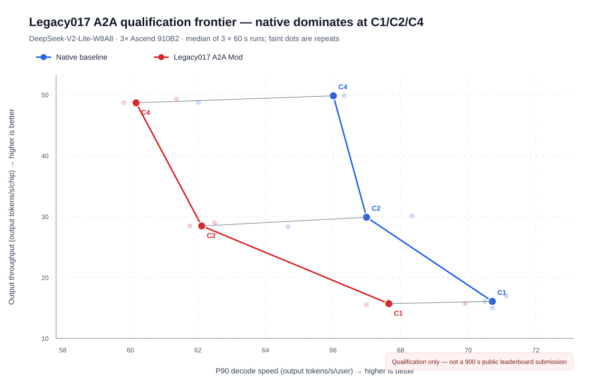

# Legacy017 A2A 资格赛占位报告

结论：Legacy017 A2A Mod 已经通过安装、启动、机制命中和最小端到端正确性门禁，但在本轮 DeepSeek-V2-Lite-W8A8 三卡 Prefill/Decode
资格赛中没有性能优势。Native 在 C1、C2、C4 的 P90 解码速度和每卡输出吞吐中位数上均同时更高，因此本轮停止在 60 秒资格赛，不进入 900 秒正式 Frontier。

图中实心点为 3 次 60 秒运行的中位数，浅色点为单次运行；横纵轴均为越大越好。灰色箭头从 Mod 指向相同并发的 Native，三个箭头均指向右上方。

## 为什么这页只占位，不进入正式 Frontier

本次实验回答的是“从历史 0.17 分支提取出的 A2A receive-buffer 复用，在当前版本载体上能否执行、是否值得扩大测试”。它不是网页 Qwen3.5 正式 cohort：

- 模型是 `DeepSeek-V2-Lite-W8A8`，而不是 `Qwen3.5-35B-A3B`；
- 拓扑是 1 卡 Prefill producer + 2 卡 Decode consumer；
- Decode 使用 DP=2、EP=2、TP=1 和 `oproj_tensor_parallel_size=2`；
- 每点是 3 次 60 秒资格运行，不是每点 900 秒正式测量；
- Qwen3.5 TP2 探针未命中 A2A 路径，不能据此画 Legacy017 的 Qwen3.5 曲线。

所以，这些点只用于展示资格赛结果和供团队选择下一步，不写入 `data/leaderboard_frontier.json`。

## 固定版本与实验变量

| 项目         | 固定值                                                                                                       |
| ------------ | ------------------------------------------------------------------------------------------------------------ |
| 模型         | DeepSeek-V2-Lite-W8A8                                                                                        |
| 硬件         | 3 × Ascend 910B2（1 Prefill + 2 Decode）                                                                     |
| vLLM Core    | `752a3a504485790a2e8491cacbb35c137339ad34`                                                                   |
| vLLM-Ascend  | `9bf964cb4b87c8cd0d6852c41a55b3c29711fa95`                                                                   |
| Mod          | `vllm-hust-legacy017-perf 0.7.0.dev0`                                                                        |
| 上下文       | 8192                                                                                                         |
| Workload     | `swe-prefix-reuse`，prepared 文件 SHA-256 `841ce21010f1a1b68ee3f890d382829eb75a77025a8698c8b1dc8e1c115f3a9d` |
| 唯一实验变量 | Decode 端是否开启 Legacy017 A2A receive-buffer 复用                                                          |

## 资格赛结果

| 并发 | Native P90 解码速度 | Mod P90 解码速度 | Mod 相对变化 | Native 每卡吞吐 | Mod 每卡吞吐 | Mod 相对变化 | 判定        |
| ---: | ------------------: | ---------------: | -----------: | --------------: | -----------: | -----------: | ----------- |
|   C1 |              70.713 |           67.652 |       -4.33% |          16.072 |       15.700 |       -2.32% | Native 支配 |
|   C2 |              66.991 |           62.113 |       -7.28% |          29.894 |       28.461 |       -4.79% | Native 支配 |
|   C4 |              66.009 |           60.170 |       -8.85% |          49.839 |       48.683 |       -2.32% | Native 支配 |

横轴单位为 output tokens/s/user，纵轴单位为 output tokens/s/chip。18 次运行均为
`valid=true`、`failed_requests=0`；表中数值为每个实验组、每档并发 3 次运行的中位数。

## 三层验收门禁

1. **服务可运行：通过。** Prefill 和 Decode 均启动并通过健康检查。
1. **机制真实执行：通过。** Mod 日志记录 `runtime_effective mechanism=a2a_receive_buffer_reuse`，不是只有安装或导入成功。
1. **最小端到端正确性：通过。** `The capital of France is` 返回 HTTP 200，生成内容以 `Paris` 开头并包含 16 个 completion
   tokens。该检查只证明请求链路可用，不等同于模型质量评测。

## 可以说与不能说

可以说：这个独立 Mod 在当前版本载体上真实执行；这一模型、拓扑和 60 秒 workload 下没有 Frontier 优势。

不能说：历史 0.17 的全部优化无效；已经复现 Qwen3.5 Frontier；这些资格赛点已经满足公开排行榜协议；机制命中等于性能提升。

## 可追溯证据

- [完整中文结果报告](https://github.com/vLLM-HUST/vllm-hust-legacy017-perf/blob/9ff8285a497e71dd0aea6c7fa838e0159df13595/experiments/runtime/results/deepseek-v2-lite-a2a-qualification-20260927/RESULTS.zh-CN.md)
- [三次原始值与中位数](https://github.com/vLLM-HUST/vllm-hust-legacy017-perf/blob/9ff8285a497e71dd0aea6c7fa838e0159df13595/experiments/runtime/results/deepseek-v2-lite-a2a-qualification-20260927/qualification_summary.json)
- [18 次运行的请求、配置与 summary](https://github.com/vLLM-HUST/vllm-hust-legacy017-perf/tree/9ff8285a497e71dd0aea6c7fa838e0159df13595/experiments/runtime/results/deepseek-v2-lite-a2a-qualification-20260927/qualification)
- [运行时机制命中日志](https://github.com/vLLM-HUST/vllm-hust-legacy017-perf/blob/9ff8285a497e71dd0aea6c7fa838e0159df13595/experiments/runtime/results/deepseek-v2-lite-a2a-qualification-20260927/frontier-legacy017-server.log#L378)
- [最小正确性响应](https://github.com/vLLM-HUST/vllm-hust-legacy017-perf/blob/9ff8285a497e71dd0aea6c7fa838e0159df13595/experiments/runtime/results/deepseek-v2-lite-a2a-qualification-20260927/correctness-response-attempt2.json)
- [预注册实验门禁](https://github.com/vLLM-HUST/vllm-hust-legacy017-perf/blob/9ff8285a497e71dd0aea6c7fa838e0159df13595/experiments/plans/deepseek_v2_lite_a2a_path_probe_20260927.json)

## 下一步供团队讨论

1. 检查 receive-buffer 复用是否只减少分配次数，却增加了图捕获或同步开销；
1. 对 Native 与 Mod 做算子级时间分解，定位 C1/C2/C4 的速度差来自通信、内存还是同步；
1. 回到历史差异清单，选择第二个可独立开关且在当前版本有可达 workload 的机制；
1. 只有出现 Native 无法覆盖的非支配资格点，才升级为 3 次 900 秒正式测量并提交生产 Frontier 数据。
